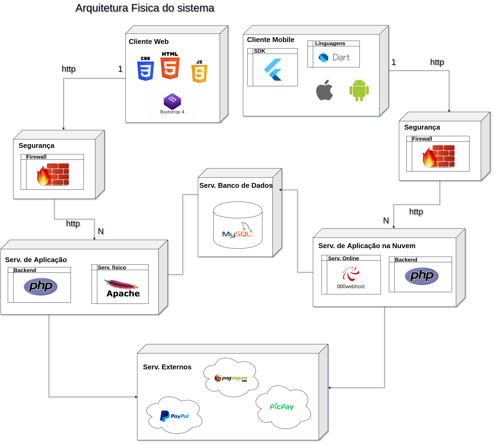

# Arquivo IFES - Projeto de Sistemas

## Sumário

- [1.Descrição](#1-Descrição-do-Contexto) 
- [2.Requisitos Não Funcionais](#2-Requisitos-Não-Funcionais) 
- [3.Táticas](#3-Táticas-para-tratar-Atributos-de-qualidade) 
- [4. Protótipos de Telas (Mockups)](#4-Protótipos-de-Tela-do-Sistema) 
- [5. Link github do aplicativo Mobile](#5-Link-github-do-aplicativo-Mobile-que-vem-sendo-desenvolvido-com-Flutter
) 
- [6. Canvas de Análise](#6-Canvas-de-Análise) 
- [7. Canvas de Projeto](#7-Canvas-de-Projeto) 
- [8. Arquitetura lógica do sistema](#8-Arquitetura-lógica-do-sistema) 
- [9. Arquitetura física do sistema](#9-Arquitetura-física-do-sistema) 
- [10. Projeto de Aplicação](#10-Projeto-de-Aplicação) 
- [11. Projeto de Lógica de Negócio](#11-Projeto-de-Lógica-de-Negócio) 
- [12. Projeto da Interface com o Usuário](#12-Projeto-da-Interface-com-o-Usuário)
- [13. Projeto da Persistência](#13-Projeto-da-Persistência)
- [Outros](#SOFTWARES-UTILIZADOS) 

### 1. Descrição do Contexto
> Atualmente o IFES campus serra é uma das referências em inovações no âmbito acadêmico. O campus possui muitos laboratórios de pesquisa e com frequência ocorrem publicações dos mesmos. O projeto Arquivo IFES será desenvolvido tanto na plataforma mobile quanto para web, tendo como principal objetivo fornecer e receber informações sobre os projetos desenvolvidos dentro do IFES - Campus Serra. Ele armazenará informações referentes a dados técnicos do projeto, colaboradores que estão envolvidos, competições e eventos as quais o laboratório/projeto já participou ou irão participar, além de exibir vídeos, fotos, comentários dos autores e usuários. Possuirá também uma área dedicada a informar se o projeto está em desenvolvimento ou finalizado, caso esteja em desenvolvimento terá a possibilidade de visualizar as vagas para o mesmo. O projeto é direcionado a usuários do IFES e da comunidade externa, como instituições financiadoras e visitantes em geral, porém a comunidade externa terá acesso restrito a plataforma. Nem sempre esse usuario de fora do meio academico possui o conhecimento técnico necessário para entender com plenitude a linguagem empregada nos artigos e documentos, logo é de grande importância o sistema ser moldado para o melhor entendimento dos projetos, mesmo que a linguagem das publicações sejam imutáveis. Apenas alunos e professores integrantes de projetos e laboratórios de pesquisa poderão editar, adicionar ou remover informações da plataforma mediante avaliação dos administradores do sistema, todos as alterações serão salvas em um histórico com as versões do projeto. Futuramente pretende-se expandir a plataforma Arquivo IFES para outros campus da grande Vitória.

### 2. Requisitos Não Funcionais

Identificador | Descrição | Categoria | Escopo 
:---------: | ---------- | :---------: | :---------: |
RNF01 |O sistema deve possuir uma linguagem simples e ser de facil navegabilidade.        |Usabilidade| Sistema|
RNF02 |O sistema deve ser capaz de autenticar usuários.                                   |Segurança de acesso |Sistema|
RNF03 |O sistema deve ser capaz de validar a permissão para editar projetos e armazenar o historico de edições, o histórico deve conter informações referentes ao usuário,data , hora e a modificação realizada no projeto. |Segurança de acesso |Sistema|
RNF04 |O sistema deve ser capaz de futuramente possuir uma versão mobile.                 |Portabilidade|Funcionalidade|
RNF05 |O sistema deve ser capaz de receber upload de videos e fotos referentes aos projetos desenvolvidos.  |Eficiência de recursos.|Sistema |
RNF06 |O sistema deve ser capaz de facilitar a comunicação entre parcerias e novos contratos através de mensagens pela plataforma e a partir de emails cadastrados.     |Usabilidade|Sistema| 
RNF07 |O sistema deve ser capaz de receber mensagens e sugestões de qualquer visitante que seja uma pessoa fisica.           |Usabilidade|Sistema|
RNF08 |A persistência das informações deverão ser implementadas em um primeiro momento utilizando ElephantSQL (armazenamento na nuvem). Entretanto no futuro deve ser possível utilizar outras tecnologias de persistência.| Portabilidade | Sistema  |
RNF09 |As funcionalidades dos administradores deverão ser acessiveis apenas via plataforma desktop, já os usuários cadastrados(alunos e professores) poderão ter acesso a suas funcionalidades tanto na versão mobile quanto na versão desktop.| Funcionalidade | Sistema |
RNF10 | Um usuário novato/visitante deverá aprender qualquer funcionalidade em no máximo 5 minutos, visto que a maioria das funcionalidades serão de visualização e envio de mensagens.|    Facilidade de Operação   |   Funcionalidade    |
RNF11 | A entrada de dados/preenchimento dos campos deve durar no máximo 1 minuto, para usuários experientes e que já estão cadastrados na plataforma.|   Operacionalidade    |   Funcionalidade   | 

### 3. Táticas para tratar Atributos de qualidade

Categoria | Requisitos Não Funcionais | Condutor de Arquitetura | Tática  
:---------: | :----------: | :---------: | --------- |
Facilidade de Operação |   RNF01      |     Não      |Mensagens de auxilio ao usuário, simplificar textos e utilizar imagens autoexplicativas.             |
Segurança de Acesso | RNF02, RNF03  |  Não  |Validação dos campos, exibir mensagens de erro/informações, histórico de edição/visualização dos projetos, autenticação por login e senha, confirmação por email.          |
   Portabilidade   |    RNF04      |   Sim   |Utilizar ferramenta que permite expansão do sistema para outra plataforma (mobile), construir um sistema responsivo.           |
 Eficiência de recursos |    RNF05      |           |Padronizar e especificar formato, tamanho e extensão dos arquivos de entrada no sistema. Ou disponibilizar o link do arquivo em um campo destinado.|
Facilidade de Operação |   RNF06, RNF07   |           |Caixa de mensagens e spans de notificações referentes ao contato entre pesquisadores/professores com parcerias.|
Modificabilidade | RNF08, RNF09 |     Sim    | Construir o projeto com base em uma arquitetura (de camadas, por exemplo), além de dividir o sistema em módulos, o que facilitará o isolamento de suas interfaces com usuário, lógica de negócio e persistência.|
 Apreensibilidade |   RNF10    |   Não   | Dar a possibilidade de um modo tutorial para o usuário iniciante/visitante, indicando onde as ações devem ser realizadas e exemplos.|
 Operacionalidade |   RNF11    | Não   | Prover mecanismos para autocompletar campos. Quando possível, deixar alguns campos preenchidos com dados padrões.|

          
### 4. Protótipos de Tela do Sistema

- [Mockup feito com Balsamiq](/ArquivoIfes_Prototipo.pdf)

### 5. Plataforma de implementação
- O sistema será implementado em duas plataformas distintas(web e mobile), afim de extrair a melhor experiência da disciplina.

- O sistema web está sendo desenvolvido nas linguagens php, javascript e alguns frameworks como laravel, ajax e bootstrap. Foi utilizado como meio facilitador para desenvolvimento o Docker container, configurado com o servidor Apache e persistência de dados no mysql Workbench.

- O sistema mobile esta sendo desenvolvido em dart, utilizando o framework do Flutter. O aplicativo faz a persistência dos dados no datafire, fornecido pelo firebase.

> https://github.com/LorranGabriel/Arquivo_ifes_mobile

### 6. Canvas de Análise

 

### 7. Canvas de Projeto

### 8. Arquitetura lógica do sistema
 

A arquitetura de software do sistema está baseada no modelo MVC(model,view,control) com algumas variações na arquitetura, como optamos por desenvolver tanto o sistema na plataforma mobile quanto na web, decidimos separar e diferenciar apenas a camada de interface com o usuário, assim temos uma interface para mobile e uma interface para web, ambos possuem dois pacotes, view e control, porém a CIU do mobile funciona como uma extensão do sistema(uma espécie de "casca"), já que não é necessario existir dois subsistemas pois a persistência e lógica de negocio são as mesmas.

### 9. Arquitetura física do sistema
 

### 10. Modelo Conceitual

### 11. Projeto de Lógica de Negócio

#### 11.1 Projeto de Dominio

#### 11.2 Métodos da Lógica de Negócio

##### 11.2.1 Regras de Negócio
Identificador | Descrição | 
:---------: | ---------- |
RN01 |Para realizar a doação de bens fisícos para os laboratórios é necessária apresentação de nota fiscal. |
RN02 |Ao realizar uma doação é necessario preenchimento do edital disponibilizado pela instituição de ensino. |
RN03 |Um professor pode orientar no máximo 4 alunos de forma simultânea, assim os laboratórios possuem uma quantidade limitada de alunos, variando de acordo com a quantidade de professores orientadores. |
RN04 |Para participar de um laboratório, o aluno deve possuir idade superior a 16 anos, estar matriculado em algum do cursos do IFES- Campus Serra e ter cursado todas as disciplinas do primeiro período do seu respectivo curso. |

#### 11.3 Projeto de Aplicação

##### 11.3.1 Diagrama de Sequência - Login Usuário

##### 11.3.2 Diagrama de Sequência - 

##### 11.3.3 Diagrama de Sequência -

### 12. Projeto da Interface com o Usuário

#### 12.1 Diagrama Estrutural da Interface com o Usuário

### 13. Projeto da Persistência

#### 13.1 Modelo Lógico do Banco

#### 13.2 Diagrama de Classes da Persistência

### 14. Implementação

### SOFTWARES UTILIZADOS
>Protótipo das telas: https://balsamiq.com 
>Diagramas: http://astah.net/ 
